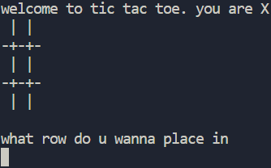
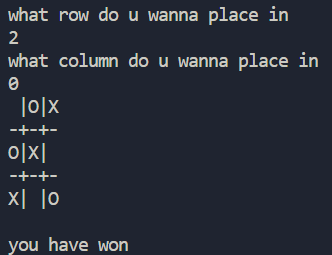

# TICTACTOE!!!

you guys already know what this game is. oh actually theres a computer instead of being 2 people

## coding process

all my projects recently have been in python and i kinda wanted to make something in java for once. big mistake... ts pmo

lowkey struggled cos i cant do java for the life of me but it whatever it works now hooray

## 'computer'

so the way the computer works is that it stores all the empty coordinates into an array and then picks **randomly** from that to make its next move. so smart. so artificial. so intelligent.

maybe in the future ill actually implement some sort of intelligence so that it makes logical moves... until then tho this is all i have

